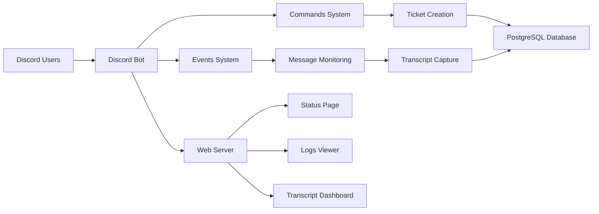

# 🎟️ feds.lol Ticket Bot


A **production-ready Discord ticket system** built with **discord.js v14**.

The bot provides a structured support workflow with:

- ticket panels  
- modal ticket forms  
- staff notifications  
- PostgreSQL transcript storage  
- live bot status dashboard  
- runtime logs viewer  

Everything runs inside a **single Render web service**, including the bot and dashboard.

---

# ✨ Features

## 🎫 Ticket System

- Category-based ticket creation
- Interactive **modal ticket form**
- Automatic ticket channel creation
- Staff role pings
- Slash command interface

---

## 🛡️ Anti-Spam Protection

- Prevents multiple open tickets per user
- Ticket creation cooldown
- Database ticket ownership validation

---

## 📜 Transcript System

- Full message transcript capture
- Stored in PostgreSQL
- Secure web dashboard access

---

## 🌐 Web Dashboard

Hosted on the same Render service.

Includes:

- transcript viewer
- bot status page
- runtime logs
- health endpoint

---

## 📩 Notifications

- DM alerts when staff reply
- Optional admin alerts for bot lifecycle events
- Prevents user self-notification spam

---

## ⚡ Production Ready

- modular command/event architecture
- cloud deployment ready
- environment variable configuration
- runtime diagnostics
- gateway debugging

---

# 📂 Project Structure

```
ticket-bot
│
├─ commands
│   ├─ close.js
│   └─ panel.js
│
├─ events
│   ├─ interactionCreate.js
│   └─ messageCreate.js
│
├─ database.js
├─ deploy-commands.js
├─ index.js
├─ package.json
└─ README.md
```

---

# 🧠 System Architecture



---

# ⚙️ Requirements

- Node.js **18+**
- PostgreSQL database
- Discord Bot Token
- Discord Application Client ID
- Discord Guild ID

---

# 🔧 Installation

Clone the repository:

```
git clone https://github.com/4VTmNzSJ5PPpIeDy5XeGjgGOq1Vl4cgV/feds.lol-Tickets.git
cd feds.lol-Tickets
```

Install dependencies:

```
npm install
```

---

# 🔑 Environment Variables

Create a `.env` file:

```
TOKEN=your_discord_bot_token
CLIENT_ID=your_discord_application_id
GUILD_ID=your_server_id
DATABASE_URL=your_postgres_connection_string

SUPPORT_ROLE_IDS=role_id_1,role_id_2

CATEGORY_GENERAL_SUPPORT=category_id
CATEGORY_REPORT_USER=category_id
CATEGORY_ACCOUNT_RECOVERY=category_id
CATEGORY_PURCHASE_BILLING=category_id
CATEGORY_BADGE_APPLICATION=category_id

LOG_CHANNEL_ID=log_channel_id
TRANSCRIPT_VIEW_KEY=secure_access_key
```

Optional runtime variables:

```
PORT=3000
NODE_ENV=production
```

---

# 🚀 Deploy Slash Commands

Before starting the bot:

```
npm run deploy:guild
```

---

# ▶️ Running the Bot

Start locally:

```
npm start
```

Example startup logs:

```
[boot] dotenv loaded
[boot] Database ready
[boot] Creating Discord client
[commands] loaded panel
[commands] loaded close
[events] registered interactionCreate
[events] registered messageCreate
[ready] Logged in as BotName
```

---

# 🎫 Ticket Workflow

```mermaid
flowchart TD

A[User clicks Ticket Panel] --> B[Select Ticket Category]

B --> C[Modal Form Opens]
C --> D[User submits description + Feds URL]

D --> E[Bot Creates Ticket Channel]

E --> F[Staff Roles Pinged]

F --> G[Staff Replies in Ticket]

G --> H[User receives DM Notification]

H --> I[/close command]

I --> J[Transcript Generated]
J --> K[Transcript Stored in Database]
K --> L[Transcript available on Dashboard]
```

1️⃣ Admin runs `/panel`  
2️⃣ User selects a **ticket category**  
3️⃣ Bot opens a **modal ticket form**

User submits:

- brief description
- Feds URL

4️⃣ Ticket channel created  
5️⃣ Staff roles pinged  
6️⃣ Staff responses trigger **DM alerts to the user**  
7️⃣ `/close` stores transcript and deletes the ticket

---

# 🌐 Web Dashboard

The bot exposes several endpoints.

---

## Transcript Dashboard

```
https://your-render-service.onrender.com/transcripts?key=YOUR_KEY
```

Features:

- search transcripts
- readable message history
- access-key protected

Example:

```
https://feds-lol-tickets.onrender.com/transcripts?key=yourkey
```

---

## Status Page

```
/status
```

Example:

```
https://your-render-service.onrender.com/status
```

Displays:

- bot state
- last login attempt
- last ready event
- last disconnect
- last warning
- last error
- last gateway debug message

JSON version:

```
/status.json
```

---

## Runtime Logs

```
/logs
```

Example:

```
https://your-render-service.onrender.com/logs
```

Displays recent runtime logs including:

- startup events
- gateway connection logs
- warnings
- errors

JSON logs:

```
/logs.json
```

---

## Health Check

```
/healthz
```

Returns:

```
ok
```

Used by Render to confirm service health.

---

# 🗄️ Database Schema

Two tables are created automatically.

### tickets

| column | type |
|------|------|
| id | SERIAL |
| guild_id | TEXT |
| channel_id | TEXT |
| user_id | TEXT |
| username | TEXT |
| category_key | TEXT |
| brief_description | TEXT |
| feds_url | TEXT |
| status | TEXT |
| created_at | TIMESTAMP |
| closed_at | TIMESTAMP |

---

### transcripts

| column | type |
|------|------|
| id | SERIAL |
| channel_name | TEXT |
| closed_by | TEXT |
| content | TEXT |
| created_at | TIMESTAMP |

---

# ☁️ Deploying to Render

Recommended deployment method.

Steps:

1. Create a **Render Web Service**

2. Connect your GitHub repository

3. Set start command:

```
npm start
```

4. Add environment variables

5. Deploy service

---

# 🧪 Troubleshooting

### Bot will not start

Check:

- valid bot token
- Node.js version
- environment variables
- PostgreSQL connection

---

### Login Stalled

If `/status` shows:

```
LOGIN STALLED
```

and the last debug message is:

```
Preparing to connect to the gateway...
```

Check:

- bot token validity
- Message Content Intent enabled
- Render networking
- local login test

---

### Slash commands missing

Run:

```
npm run deploy:guild
```

---

### Tickets not creating

Verify:

- category IDs
- support role IDs
- bot permissions

---

### Transcript dashboard 502

Possible causes:

- Render cold start
- database initializing
- recent redeploy

Refreshing usually resolves it.

---

# 🔐 Security

Never commit `.env`.

If a token leaks:

1. regenerate token in Discord Developer Portal
2. update environment variables
3. redeploy service

Keep `TRANSCRIPT_VIEW_KEY` private.

---

# 📜 License

MIT License

---

# 👤 Authors

Developed for **feds.lol Support Infrastructure**

**[@dxiv](https://github.com/dxiv)**  
**[@Intro](https://github.com/4VTmNzSJ5PPpIeDy5XeGjgGOq1Vl4cgV)**